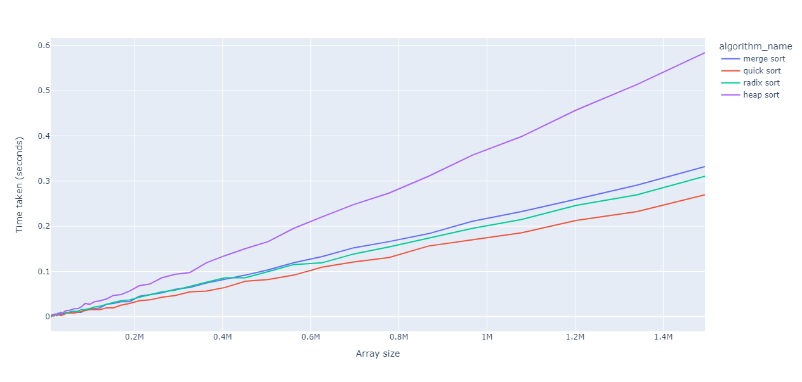
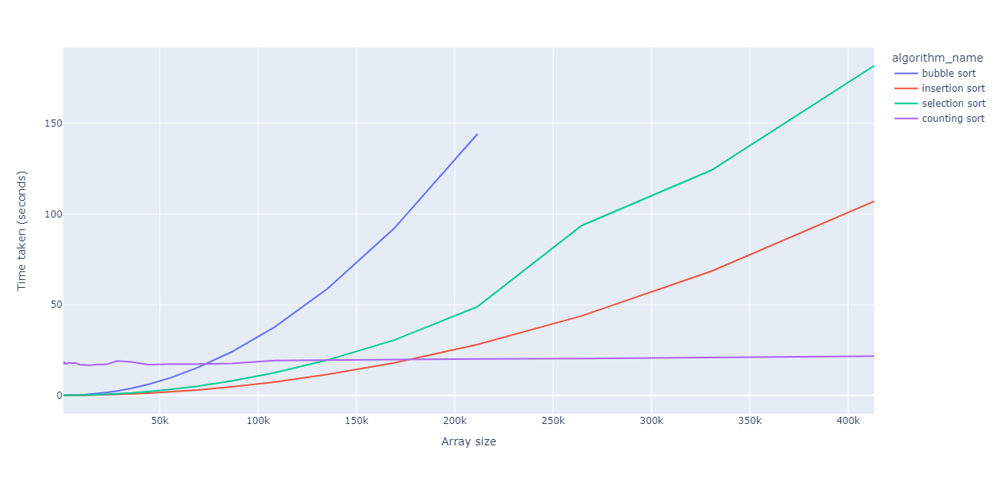
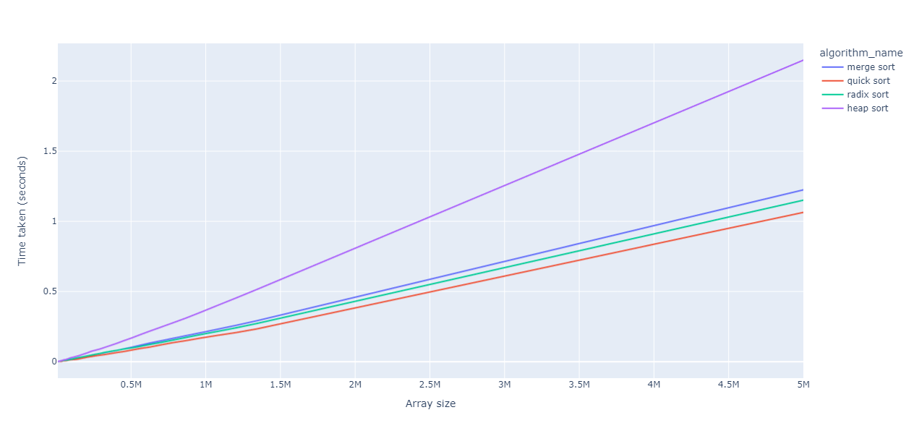
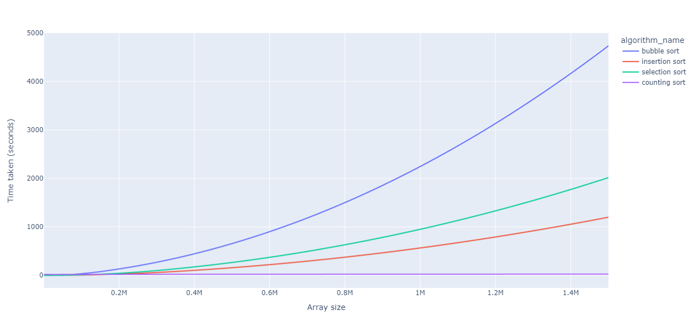

# Sorting-Algorithms-in-C

This repository contains a project that compares the performance of various sorting algorithms in C language.

## Relevant charts

### Raw data

These are relevant charts that represent the execution times of different sorting algorithms according to the size of the array to be sorted.





### Extrapolation

I had the idea to make an extrapolation on the existing data, here are the charts which predict the execution time according to the size of the array.





## Build Project

### 1. Create MakeFile
```sh
mkdir build install_dir && cd build && cmake ../src -DCMAKE_INSTALL_PREFIX=../install_dir -DCMAKE_BUILD_TYPE=Debug
```

### 2. Run Makefile
```sh
make
```
If you want to install generated files, run the following command.
```sh
make install
```

### 3. Run Project
```sh
./main
```

### 4. Run unit tests
```sh
make test
```
