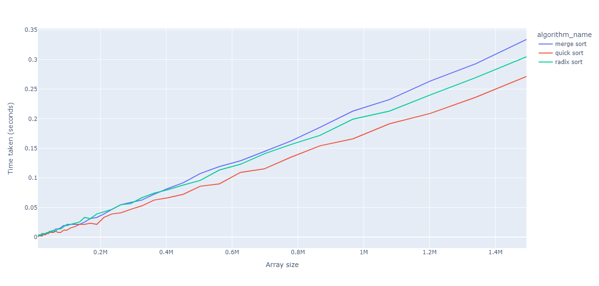

# Sorting-Algorithms-in-C

This repository contains a project that compares the performance of various sorting algorithms in C language.

## Relevant charts

These are relevant charts that represent the execution times of different sorting algorithms according to the size of the array to be sorted.



## Build Project

### 1. Create MakeFile
```sh
mkdir build && cd build && cmake ../src && make
```

### 2. Run Project
```sh
./main
```
